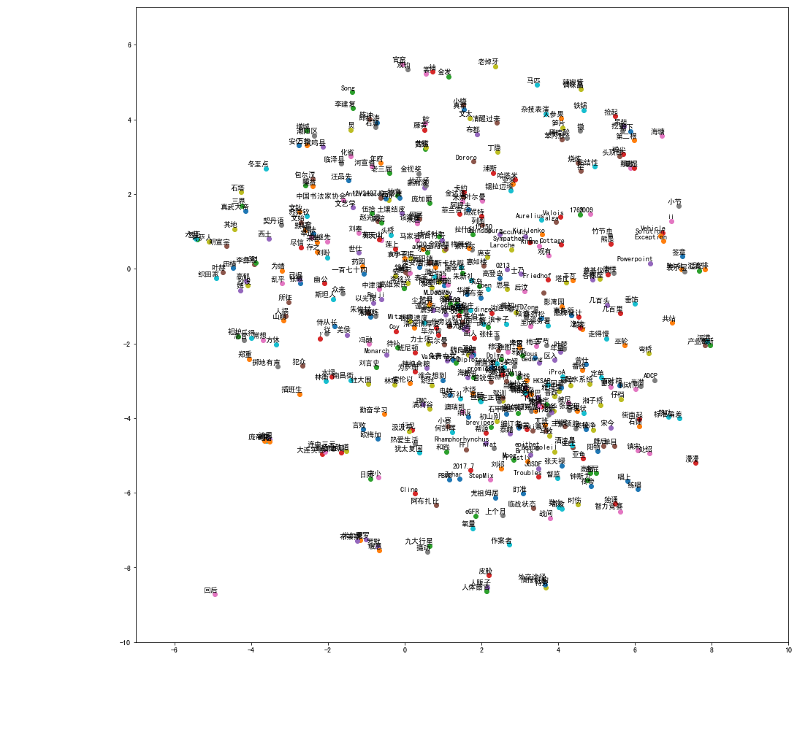

# NLP 项目1

## Step-1 数据预处理
####  1. 维基百科中文语料库的处理

- 下载[维基百科中文语料数据库](https://ftp.acc.umu.se/mirror/wikimedia.org/dumps/zhwiki/20
191120/zhwiki-20191120-pages-articles-multistream.xml.bz2)

- 使用[wikiextractor](https://github.com/attardi/wikiextract)提取维基百科的信息结构
```python
python3 WikiExtractor.py -b 1024M -o extracted zhwiki-20191120-pages-articles-multistream.xml.bz2
```
这里 1024M 指的是一个语料库文件的大小。此时，在extracted文件夹中，生成 wiki_00 和 wiki_01 两个文件。文件格式如下所示：
```html
<doc id="13" url="https://zh.wikipedia.org/wiki?curid=13" title="数学">
数学

数学是利用符号语言研究数量、结构、变化以及空间等概念的一门学科，从某种角度看属于形式科学的一种......
</doc>
```

- 繁体转换为简体
下载并安装[opencc](https://github.com/BYVoid/OpenCC)，执行以下代码：
```bash
opencc -i wiki_00 -o zh_wiki_00 -c t2s.json
opencc -i wiki_01 -o zh_wiki_01 -c t2s.json
```
这样，生成 zh_wiki_00 和 zh_wiki_01 两份简体中文语料库。

- 使用正则表达式提取文章内容，利用 jieba 进行[分词操作](https://www.jianshu.com/p/e2d13d058ac6)
```python
import re
import jieba
import os

def get_stopwords():
    stop_word = set()
    with open('/home/kuan/Desktop/NLP/project1/zh_stopwords') as f:
        for word in f:
            stop_word.add(word.strip('\n'))
    return stop_word

#提取<doc>和</doc>之间的内容，并进行分词操作
def parse_wiki(input_file_name, output_file_name):
    reg = '[^<doc.*>$]|[^</doc>$]'
    file = open(input_file_name, 'r', encoding='utf-8')
    output = open(output_file_name, 'w+', encoding='utf-8')
    content_line = file.readline()
    article_contents = ""
    stop_words = get_stopwords()
    count = 0

    while content_line:
        match_obj = re.match(reg, content_line)
        content_line = content_line.strip('\n')
        content_line = rplc(content_line)
        if len(content_line) > 0:
            if match_obj:
                words = jieba.cut(content_line, cut_all=False)
                for word in words:
                    if word not in stop_words:
                        article_contents += word + " "
            else:
                if len(article_contents) > 0:
                    count += 1
                    print("Writing {} article into file {}".format(count, output_file_name))
                    output.write(article_contents + '\n')
                    article_contents = ""
        content_line = file.readline()
    output.close()
    file.close()

#去除特殊符号
def rplc(line):
    line = line.replace('(','')
    line = line.replace(')','')
    line = line.replace('[','')
    line = line.replace(']','')
    line = line.replace('《','')
    line = line.replace('》','')
    line = line.replace('「','')
    line = line.replace('」','')
    line = line.replace('『','')
    line = line.replace('』','')
    line = line.replace('（','')
    line = line.replace('）','')
    return line

def main():
    dir = '/home/kuan/Desktop/NLP/project1/'
    file1 = os.path.join(dir, 'zh_wiki_00')
    file2 = os.path.join(dir, 'zh_wiki_01')
    out1 = os.path.join(dir, 'zh_wiki_parsed_00')
    out2 = os.path.join(dir, 'zh_wiki_parsed_01')
    parse_wiki(file1, out1)
    parse_wiki(file2, out2)

if __name__ == '__main__':
    main()
```
#### 2. 汉语新闻语料库

- 下载[汉语新闻语料库]( https://github.com/Computing-Intelligence/datasource/blob/master/export_sql_1558435.zip)

- 进行数据提取和分词操作
```python
import jieba, re
import pandas as pd

filename = '/home/kuan/Desktop/NLP/project1/sqlResult_1558435.csv'
data = pd.read_csv(filename, encoding='gb18030')
articles = list(data.content)

with open('/home/kuan/Desktop/NLP/project1/data','w+',encoding='utf-8') as file:
    for a in articles:
        article = ''.join(aa for aa in re.findall('\w+', str(a)))
        words = jieba.cut(article, cut_all=False)
        article_contents = ""
        for word in words:
            article_contents += word + " "
        file.write(article_contents + "\n")
```

#### 3. 合并处理好的文件
将处理好的文件保存在 data_result 中。

```python
import os
input_names = ['zh_wiki_parsed_00', 'zh_wiki_parsed_01', 'data']
output_name = 'data_result'
dir = '/home/kuan/Desktop/NLP/project1'

output = open(os.path.join(dir, output_name), 'w', encoding='utf-8')
for input_name in input_names:
    input = open(os.path.join(dir, input_name))
    line = input.readline()
    while line:
        output.write(line)
        line = input.readline()
    input.close()
output.close()
```
#### 4. 使用Gensim训练词向量

```python
from gensim.models import word2vec
import multiprocessing
filename = '/home/kuan/Desktop/NLP/project1/data_result'

sentences = word2vec.LineSentence(filename)
model = word2vec.Word2Vec(sentences, size=300, workers=multiprocessing.cpu_count())

model.save("/home/kuan/Desktop/NLP/project1/wiki.model")
```
将训练好的模型保存在 wiki.model文件中。
```python
model = gensim.models.Word2Vec.load('/home/kuan/Desktop/NLP/project1/wiki.model')
```
采用以上 load 方法可载入已经训练好的模型。

#### 5. 词向量的测试效果

- 词向量的语义相似性

输入：
```python
model.wv.most_similar('男人')
```
输出：
```python
[('女人', 0.8653285503387451),
 ('女孩', 0.6289257407188416),
 ('陌生人', 0.6149635314941406),
 ('女孩子', 0.6145404577255249),
 ('做爱', 0.5826796293258667),
 ('家伙', 0.5728805065155029),
 ('小孩', 0.5683950781822205),
 ('男孩子', 0.5661417841911316),
 ('男孩', 0.5628513097763062),
 ('小女孩', 0.5563579797744751)]
```
输入：
```python
model.wv.most_similar('人工智能')
```

输出：

```python
[('人工智慧', 0.7968352437019348),
 ('AI', 0.7388073801994324),
 ('专家系统', 0.6119589805603027),
 ('智能', 0.6113088726997375),
 ('计算机', 0.6071544885635376),
 ('虚拟现实', 0.6028905510902405),
 ('计算机技术', 0.5992910861968994),
 ('机器翻译', 0.5872463583946228),
 ('机器人', 0.5864192843437195),
 ('人机交互', 0.5769561529159546)]
```

- 词向量的语义线性关系
```python
def analogy(x1, x2, y1):
    result = model.wv.most_similar(positive=[x2, y1], negative=[x1])
    return result[0][0]
```
输入：```analogy('中国','汉语','美国')```

输出：```'英语'```

输入：```analogy('飞机','机场','火车')```

输出：```'火车站'```

- 词向量的可视化。

  设置 matplotlib [支持中文字体](https://blog.csdn.net/DicserYan2518/article/details/84501315)，然后使用 [t-SNE]( https://www.kaggle.com/jeffd23/visualizing-word-vectors-with-t-s) 进行高位向量的可视化。这里选取了500个词组进行可视化操作。
```python
from sklearn.manifold import TSNE
import matplotlib.pyplot as plt

def tsne_plot(model):
    labels = []
    tokens = []
    count = 0
    for word in model.wv.vocab:
        count += 1
        if count <50000 and count % 100 == 0:
            tokens.append(model[word])
            labels.append(word)
            
    tsne_model = TSNE(perplexity=40, n_components=2, init='pca', n_iter=2500, random_state=42)
    new_values = tsne_model.fit_transform(tokens)
    
    x, y = [], []
    for value in new_values:
        x.append(value[0])
        y.append(value[1])
        
    plt.figure(figsize=(16,16))
    
    plt.axis([-10, 10, -10, 10])
    for i in range(len(x)):
        plt.scatter(x[i], y[i])
        plt.annotate(labels[i], xy=(x[i], y[i]), xytext=(5,2), textcoords='offset points', ha='right', va='bottom')
    plt.show()
```
得到的图像如下所示:
