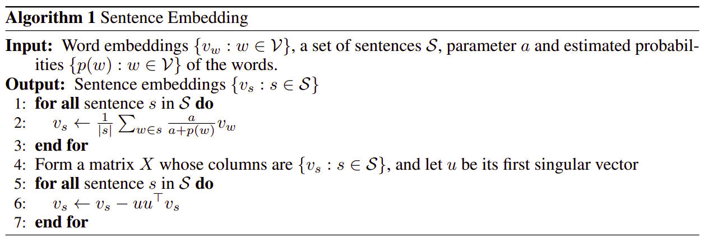

# NLP 项目1

## Step-2 核心模型的搭建
### 1. 句子的 SIF 向量化
基于单词的向量化，使用普林斯顿大学提出来的 [SIF方法](https://openreview.net/pdf?id=SyK00v5xx)，进行句子的向量化。

- 根据之前清理得到的分词数据，建立词频字典，并保存位 json 格式，方便后续读取。

```python
import gensim
import json
model = gensim.models.Word2Vec.load('/home/kuan/Desktop/NLP/project1/wiki.model')

def get_dictionary():
    d_path = '/home/kuan/Desktop/NLP/project1/data_result'
    word_count = {}
    total = 0
    count = 1
    with open(d_path, 'r') as f:
        line = f.readline()
        while line:
            print('Processing line {}'.format(count))
            words = line.split(' ')
            for word in words:
                total += 1
                if word not in word_count:
                    word_count[word] = 1
                else:
                    word_count[word] += 1
            line = f.readline()
            count += 1
    for word in word_count:
        word_count[word] /= total
    return word_count

dictionary = get_dictionary()

with open('dictionary.json', 'w+') as f:
    json.dump(dictionary, f, ensure_ascii=False)
    f.write('\n')
```

可通过以下函数载入词频数据：

```python
import json
def get_word_frequency(word):
    with open('dictionary.json', 'r') as f:
        dictionary = json.load(f)
    if word in dictionary:
        return dictionary[word]
    else:
        return 1
```

- SIF模型的实现



利用SIF模型，生成句子向量。输入是句子 sentece，向量长度 embedding_size，以及超参数 a 。输出为长度为 embedding_size 的句子向量。

```python
import numpy as np
from sklearn.decomposition import PCA

#定义Word类和Sentence类
class Word:
    def __init__(self, text, vector):
        self.text = text
        self.vector = vector
    def __str__(self):
        return self.text + ' : ' + str(self.vector)
    
class Sentence:
    def __init__(self, word_list):
        self.word_list = word_list
    def len(self):
        return len(self.word_list)
    def __str__(self):
        word_list_str = [word.text for word in self.word_list]
        return ''.join(word_list_str)
    
#利用SIF生成句子向量
def sentence2vec(sentence, embedding_size, a):
    sentence_vector = np.zeros(embedding_size)
    sentence_length = sentence.len()
    for word in sentence.word_list:
        aa = a / (a + get_word_frequency(word.text))
        sentence_vector = np.add(sentence_vector, np.multiply(aa, word.vector))
    sentence_vector = np.divide(sentence_vector, sentence_length)
        
    pca = PCA()
    pca.fit([sentence_vector])
    u = pca.components_[0]
    
    uuTv = np.multiply(np.multiply(u, u.T), sentence_vector)
    sv = np.subtract(sentence_vector, uuTv)
    return sv
```

### 2. 根据句子向量，为每个句子赋予权值，并获取相似度

- 定义 gen_vector 函数，根据文章的标题和内容，生成标题向量、句子向量列表，和文章内容向量。

```python
import re
import jieba

#去除句子中的冗余信息
def clean_sentence(line):
    line = line.replace('(','')
    line = line.replace(')','')
    line = line.replace('[','')
    line = line.replace(']','')
    line = line.replace('《','')
    line = line.replace('》','')
    line = line.replace('「','')
    line = line.replace('」','')
    line = line.replace('『','')
    line = line.replace('』','')
    line = line.replace('（','')
    line = line.replace('）','')
    line = line.replace('【','')
    line = line.replace('】','')
    line = line.replace('、','')
    line = line.replace('……','')
    line = line.replace('“','')
    line = line.replace('”','')
    line = line.replace('‘','')
    line = line.replace('’','')
    line = line.replace('\'','')
    line = line.replace('\",'')
    return line

#根据标题和文章内容，生成标题向量，句子向量列表，和文章内容向量
#input: title->str, article->str
#output: title_sv->vector, sv_list->list of vector, airticle_sv->vector, origin_sentences->str
def gen_vector(title, article):
    #按照以下标点符号分割句子
    reg_str = r'，|。|！|？'
    sentences = re.split(reg_str, article)
    symbols = re.findall(reg_str, article)
    original_sentences = [s1 + s2 for s1, s2 in zip(sentences, symbols)]
    clean_sentences = [clean_sentence(s) for s in sentences if s != '']
    
    sv_list = []
    for sentence in clean_sentences:
        word_list = []
        s_cut = list(jieba.cut(sentence))
        for word in s_cut:
            word_list.append(Word(word, model.wv[word]))
            article_word_list.append(Word(word, model.wv[word]))
        sv_list.append(sentence2vec(Sentence(word_list), embedding_size=300, a=0.001))
    article_sv = sentence2vec(Sentence(article_word_list), embedding_size=300, a=0.001)

    clean_title = ''.join(re.split(reg_str, clean_sentence(title)))
    title_cut = list(jieba.cut(clean_title))
    word_list = []
    title_list = []
    for word in title_cut:
        word_list.append(Word(word, model.wv[word]))
    title_sv = sentence2vec(Sentence(word_list), embedding_size=300, a=0.001)
    return title_sv, sv_list, article_sv, original_sentences
```

- 获得文章中，每个句子向量与标题以及文章内容的语义相关性。这里定义为两个向量之间的余弦相似度，并使之分布在0~1之间。

```python
import numpy as np

#计算向量之间的余弦相似度
def cos_sim(v1, v2):
    cos = np.dot(v1, v2) / (np.linalg.norm(v1) * np.linalg.norm(v2))
    return 0.5 * cos + 0.5 

```

- 对文章中d的每个句子向量利用KNN的思想，进行平滑处理。这样做的目的，是为了保证相邻句子与全文的语义相似度之间的差异不会太大。

```python
import numpy as np
def knn_smooth(sv, n_neighbors):
    sv_smooth = []
    if n_neighbors *2 + 1 > len(sv):
        return sv
    for (i, v) in enumerate(sv):
        if i < n_neighbors:
            sv_smooth.append(np.mean(sv[:n_neighbors + i + 1],axis=0))
        elif i + n_neighbors > len(sv):
            sv_smooth.append(np.mean(sv[i - n_neighbors:],axis=0))
        else:
            sv_smooth.append(np.mean(sv[i - n_neighbors:i + n_neighbors + 1],axis=0))
    return sv_smooth
```

- 根据句子向量以及句子向量之间的相似度，得到每个句子与标题以及文章内容之间的相似程度。然后对句子的相似程度进行排序，获得最相关的 n 个句子。

  ```python
  #输入：title向量，sentence向量，content向量，alpha权重
  #输出：0~1的值列表，表示每个句子向量与content以及title的相似程度。
  def correlation(title, sentence, content, alpha):
      #参数alpha表示title与句子相似度的贡献程度，1-alpha表示content与句子相似度的贡献程度
      results = []
      sentence_smooth = knn_smooth(sentence, n_neighbors=1)
      for s in sentence_smooth:
          corr = alpha * cos_sim(s, title) + (1 - alpha) * cos_sim(s, content)
          results.append(corr)
      return results
  
  
  #对句子相似度进行排序，取出 Top_n，得到语义上最相近的n个句子。
  def top_n(sim_list, n):
      if n >= len(sim_list):
          return list(len(sim_list))
      else:
          return np.argsort(-np.array(sim_list))[:n]
  ```

### 3. 获得 end-to-end 模型

把之前的步骤合并起来，构造一个 gen_text(title, article, n_top=N) 函数。这个函数输入文章的标题和内容，然后输出是一个string，这个string是和文章意义最相关的N个句子，我们作为摘要输出内容即可。

```python
def gen_text(title, article, n_top=2):
    title_sv, sv, article_sv, original_sentences = gen_vector(title, article)
    sim_list = correlation(title_sv, sv, article_sv, alpha=0.2)
    n_list = top_n(sim_list, n_top)
    output = ''
    for i in sorted(n_list):
        output += original_sentences[i]
    if output[-1] not in r'，|。|！|？':
        output = output[:-1] + '。'
    return output
```

