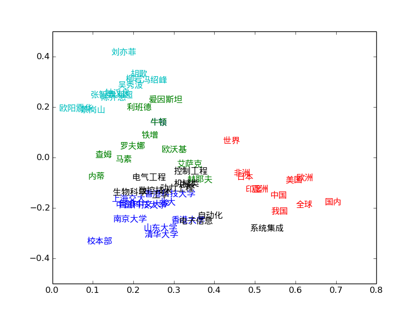
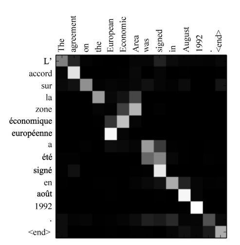
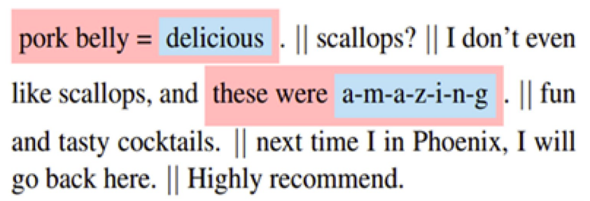
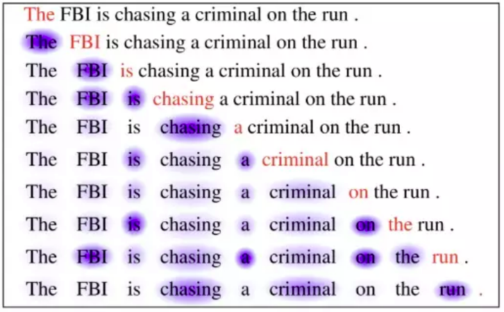
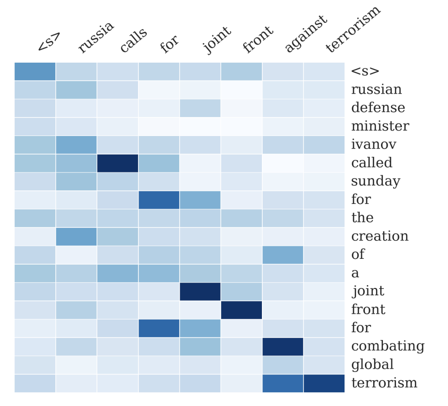

### NLP Assignment 09

### 1. 思考在自然语言处理中如何发掘模型的可解释性

- 利用降维后的结果，通过作图可解释词向量之间的相互关系。

[word2vec构建中文词向量](https://www.cnblogs.com/newsteinwell/p/6034747.html)

- 在注意力机制中，将注意力的权重进行可视化，可以清楚地看出一种语言中的单词是如何以来另一种语言进行翻译的。

- 在文本分类任务中，同样使用注意力权重，可量化每个词的重要性，帮助理解每个词对分类结果的贡献程度。

参考资料：[机器学习模型可解释性方法、应用与安全研究综述](https://nesa.zju.edu.cn/download/%E6%9C%BA%E5%99%A8%E5%AD%A6%E4%B9%A0%E6%A8%A1%E5%9E%8B%E5%8F%AF%E8%A7%A3%E9%87%8A%E6%80%A7%E6%96%B9%E6%B3%95%E3%80%81%E5%BA%94%E7%94%A8%E4%B8%8E%E5%AE%89%E5%85%A8%E7%A0%94%E7%A9%B6%E7%BB%BC%E8%BF%B0.pdf)

### 2. 在 Seq2Seq 和注意力机制中如何可视化模型细节

Seq2Seq模型，通过Encoder和Decoder的过程，将一个输入序列转化成输出序列，通常用于机器翻译、问答对话生成等 

- 如问题1中所述，在机器翻译中，可将Attention权重可视化。

- 在机器阅读中，通过可视化self-attention，可以看到当前词与句中先前词之间的关联性。

- 文本摘要生成中，Attention用于将输出摘要中的每个单词与输入文档中的特定单词相关联，可以用来解释输入Sentence与输出Summary之间单词的对应关系。

### 3. 对抗样本能否运用到自然语言处理模型中

对抗样本（adversarial examples）是指，对输入样本故意添加一些人无法察觉的细微干扰，导致模型以高置信度给出一个错误的输出。

对抗样本通常用于图像数据上，较难用于NLP模型中。这是因为组成文本的词语一般以word vector的形式表示，是离散值，而非连续值。微小的扰动可能会对vector代表的含义造成较大的影响。

因此在 NLP 中，对抗样本训练不是为了防御对模型的恶意攻击，而是作为 Regularization 的一种手段，提升模型的泛化性能，防止过拟合。

### 4. 复现 Kaggle 心脏病数据集冠军kernel，理解所用的模型可解释性技巧

另见notebook.